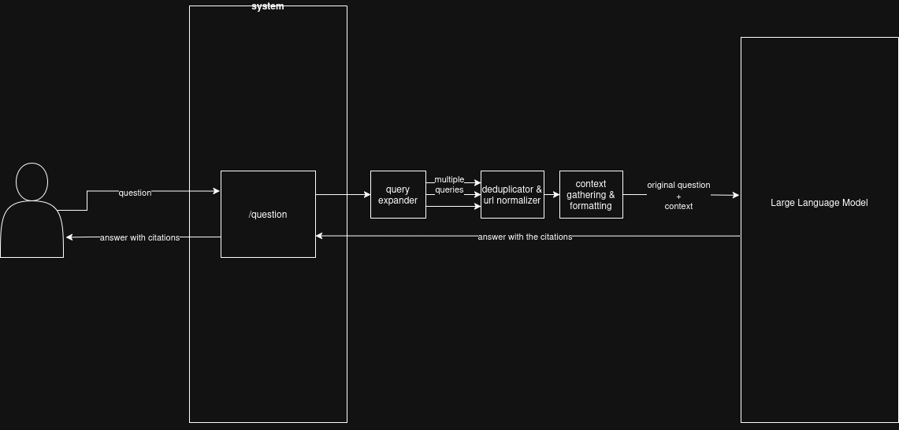

# perplex_city

`perplex_city` is a perplexity like LLM system that makes use of web searches to mitigate hallucinations.
The core concept is similar to that of a RAG system except that you don't explicitly have to use vector embeddings.

This repository has two major branches, namely `main` (with vector embeddings) and `norag` (without vector embeddings).

The simple architecture diagram of the system without the vector database is as follows:

### Here's how the system works:
- User asks a question
- Multiple questions similar to the original question are produced using `query_expander`. It results multiple questions similar to the original question of user, from different angle.
- `web_search` is used in order to perform google search and find the most relevant links to the questions produced. It results in a list of URLs.
- `deduplicator` is used in order to remove all the duplicate URLs from the list and normalize them as well.
- Each normalized & original URLs are then visited and the contexts (title, url, text) are extracted and stored as context_data.
    - (only for vector embeddings)
        - Chunks are prepared from the given context_data, and they are stored as FAISS index.
        - For the retrieval, a similarity search is performed first between the original question and given sets of chunks, followed by reranking in order to retrieve the most relevant document.
- The `original query` of the user and this `retrieved contexts` are finally passed on to the `generator` function in order to produce a response.

### Tools summarization:
- Web search: **DuckDuckGo websearch API**
- Extract web contents: **Trafilatura**
- LLM: **gemini-2.5-flash-lite**
- Vector database: **FAISS**
- Reranker: **ms-marco-MiniLM-L-6-v2**

### Remaining checklist:
- [ ] **Evaluate** the system, and list the evaluation params and observations.
- [ ] Improve **performance efficiency** of the system and **use SOTA tools & practices**.
- [ ] **Keep refining the system** to improve the performance in accordance with evaluation metrics.
